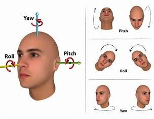
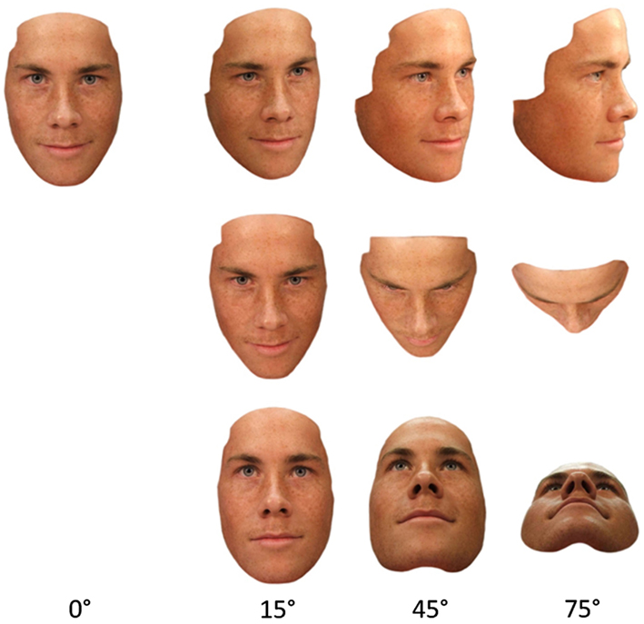

1) Detection
2) Tracking
3) Track state update
4) Quality filtering
5) Embedding (controlled frequency)
6) FAISS match
7) Identity assignment
8) Event publishing

# 1️⃣ What buffalo_l actually is
- buffalo_l is not a single model.
- It is a bundle of multiple models:

# AI Events emitted to node
- track_created
- track_updated
- face_detected
- recognition_pending
- recognition_confirmed
- track_lost

# Mechanism Guide
| What | Mechanism |
|------|-----------|
| Track lifecycle changes | Pub/Sub events |
| Continuous bbox updates | WebSocket / Stream |
| Persistent track state | Redis Hash |
| Analytics logging | MongoDB |

# Track Sequence
YOLO track start
      ↓
track_created
      ↓
track_updated
      ↓
face_detected
      ↓
recognition_pending
      ↓
recognition_confirmed
      ↓
track_lost

# Flow Diagram
Detection
   ↓
Tracking (BoTSORT)
   ↓
Embedding
   ↓
Search Known Index
   ↓
Match?
 ├─ YES → known stabilization → identity confirmed
 └─ NO
        ↓
   Search Unknown Index
        ↓
   Unknown stabilization (3 frames)
        ↓
   Create or update unknown identity

## Face Filter Metrics
### 👁️ Visual intuition

#### ✅ Yaw (left ↔ right turn)

| Yaw | Meaning | Should you keep it? |
|---:|---|---|
| 0° | Perfect frontal | ✅ YES (ideal) |
| 10–20° | Slight turn | ✅ YES |
| 25–30° | Noticeable turn | ⚠️ Borderline |
| 35°+ | Side face | ❌ NO |

**Image (add later):**

#### ✅ Pitch (up ↕ down tilt)

| Pitch | Meaning | Keep? |
|---:|---|---|
| 0° | Straight | ✅ |
| 10–15° | Slight tilt | ✅ |
| 20° | Strong tilt | ⚠️ |
| 25°+ | Looking up/down heavily | ❌ |

**Image (add later):**

👉 Cameras mounted high/low make this very common

#### ✅ Roll (head tilt sideways)

| Roll | Meaning | Keep? |
|---:|---|---|
| 0° | Straight | ✅ |
| 10–15° | Slight tilt | ✅ |
| 20° | Noticeable | ⚠️ |
| 25°+ | Tilted head | ❌ |

**Image (add later):**

